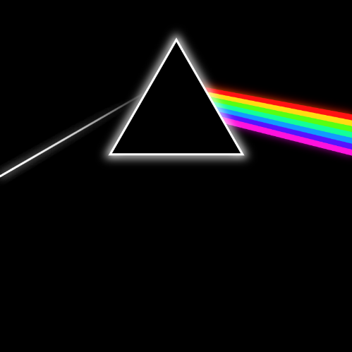
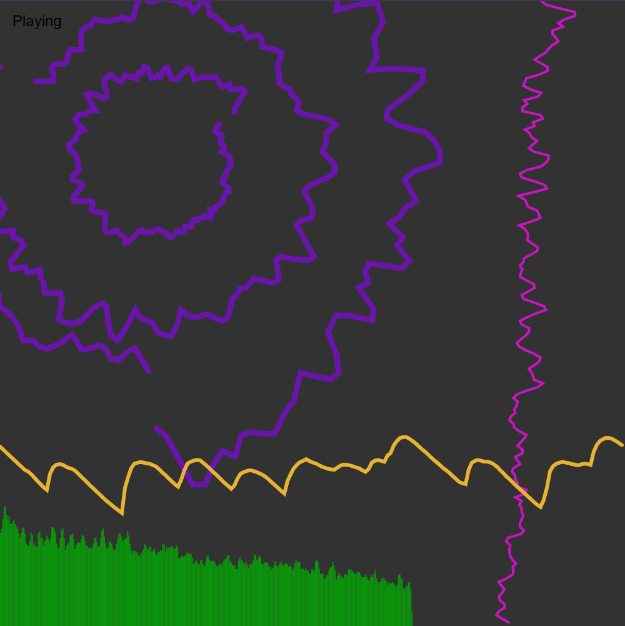
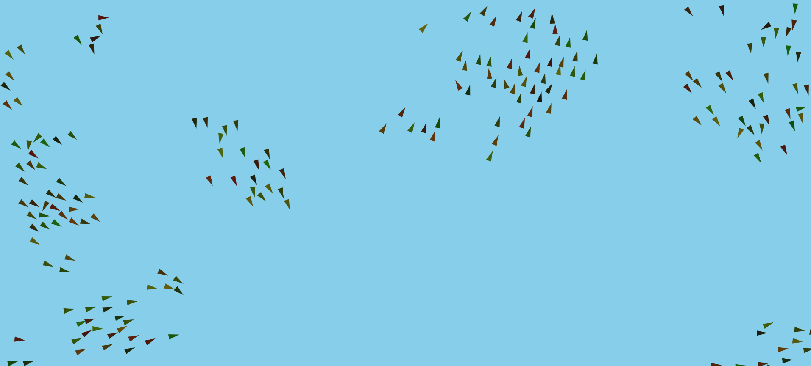

## By Joe Cross

### Experiment 1: Artwork

For my first project, I have decided to create a replica of the album cover for Pink Floyd's "Dark Side of the Moon". I used this as an introduction to my portfolio, a way to show some basic skills in p5js and a way prove that code can be used to create artistic experiences that are dynamic and not perfectly still. I believe that this first project is highly simple in its initial approach. I have used simple functions and rudimentary programming techniques. This has allowed me to create something that is simple and easy-to-understand yet interesting. I decided to choose the album cover for the main reason of simplicity. The cover is highly geometric with only basic shapes (e.g., triangles and lines) in it. This simplicity gave me space to create new things within my variations upon the original. This experiment has shown me the ways that simple shapes and ideas can be used in more complex ways to create experiences that are more than the sum of their parts. I have also created two other version of this album cover: one with a square prism instead of a triangular and one that changes the rainbow from perlin noise.

[Original Sketch](experiments/exper-1/artwork/index.html)

[Variant 2: Square Instead of Triangular Prism](https://github.com/jsc-264/CCO4104-Creative-Coding-Portfolio/blob/experminets-1-AWK-square/experiments/exper-1/artwork/index.html)

[Variant 3: Rainbow that Changes with Perlin Noise](https://github.com/jsc-264/CCO4104-Creative-Coding-Portfolio/blob/experiments-1-AWK-colour-noise/experiments/exper-1/artwork/index.html)

### Experiment 2: FFT Audio Visualiser

My second project is a Fast Fourier Transform (FFT) algorithm audio visualiser. here, I have used the algorithm to display the frequencies of specific songs in a variety of different ways. This is the first time I have tried to use this algorithm and it highly interested me as it allowed me to manipulate music in ways that I didn't know how to before. This also has shown me how programmers are able to link different kinds of artistic media together. I have created two variants of this visualisation. One allows the user to switch between songs with the arrow keys and pause using the space bar. This allowed me to better understand using music in a more literal sense: giving me the ability to use music more efficiently i the future - especially in p5 projects. For my second variation, I looked more closely into the FFT algorithm and allowed it to change colour with respect to the volume and pitch of the track. I was able to understand how the algorithm interprets the music and how user input can drastically change the look of the visualisation.

[Original Sketch](experiments/exper-2/FFT/index.html)

[Variant 2: The Ability to Switch what Song is Playing](https://github.com/jsc-264/CCO4104-Creative-Coding-Portfolio/blob/experiments-2-FFT-many-songs/experiments/exper-2/FFT/index.html)

[Variant 3: Lines Change Colour Based off Music and Mouse](https://github.com/jsc-264/CCO4104-Creative-Coding-Portfolio/blob/experiments-2-FFT-colour/experiments/exper-2/FFT/index.html)

### Experiment 3: Flocking Simulation

My last project is a recreation of a flocking algorithm created by Craig Reynolds in 1986. For the time that I have known p5js and - more specifically - Daniel Shiftman's 'coding train'. I have been interested in this flocking simulation but I have never had time or courage to try it myself; I didn't want to just copy the code, I wanted to understand and create the concepts myself and implement them without always looking at a tutorial. This Experiment allowed me to do that and understand this algorithm in a more independent way. Like my other experiments, I have 2 variations of my initial sketch. One introduces sliders into the algorithm to change the separation, alignment and cohesion of the program - which changes how each of the birds interact with each other. This variant is fun to play with and also helps me understand the importance of user input and interaction. My other variant involves each bird having its own lifespan which, as the program progresses, decreases. Each bird dies once the lifespan is too low and I have allowed the user to spawn in new birds by dragging the mouse across the canvas.

[Original Sketch](experiments/exper-3/system/index.html)

[Variant 2: Sliders to Change the Behaviour of the Birds](https://github.com/jsc-264/CCO4104-Creative-Coding-Portfolio/blob/experiments-3-SYS-sliders/experiments/exper-3/system/index.html)

[Variant 3: Each Bird has a Lifespan and the Mouse can Spawn Birds](https://github.com/jsc-264/CCO4104-Creative-Coding-Portfolio/blob/experiments-3-SYS-lifespan/experiments/exper-3/system/index.html)
